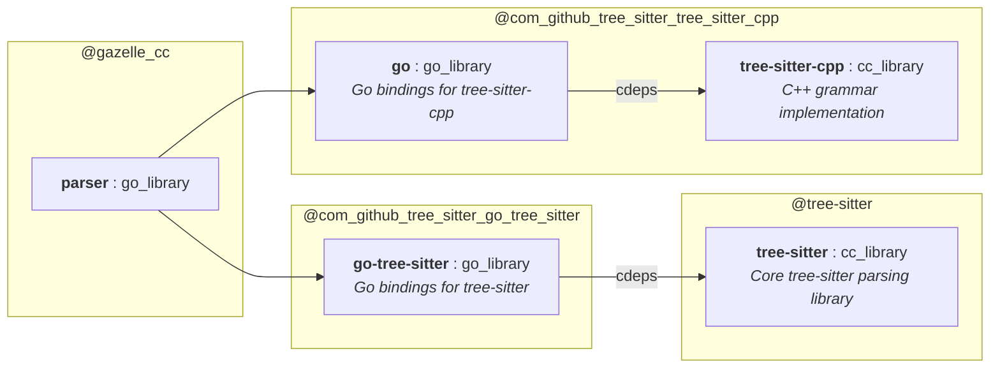

# Patches for the `tree-sitter` library dependency

Gazelle `go_deps` extension is struggling with the [official repositories](https://tree-sitter.github.io/tree-sitter/index.html) we want to use:

- https://github.com/tree-sitter/tree-sitter-cpp
- https://github.com/tree-sitter/go-tree-sitter

The reason is how Go bindings seek C++ headers/sources.

## Problems with tree-sitter-cpp

Package `tree_sitter_cpp` tries to inject sources from a location relative to `bindings/go/binding.go` file.

```go
// #cgo CFLAGS: -std=c11 -fPIC
// #include "../../src/parser.c"
// #include "../../src/scanner.c"
import "C"
```

Importing `"github.com/tree-sitter/tree-sitter-cpp/bindings/go"` without any patch will cause a compilation error:
```
bindings/go/binding.go:4:11: fatal error: '../../src/parser.c' file not found
    4 |  #include "../../src/parser.c"
      |           ^~~~~~~~~~~~~~~~~~~~
```

Gazelle is unable to add the missing source file when it is included this way.

## Problems with go-tree-sitter

Package `tree_sitter` tries to include `include/tree_sitter/api.h`.

```go
/*
#cgo CFLAGS: -Iinclude -Isrc -std=c11 -D_POSIX_C_SOURCE=200112L -D_DEFAULT_SOURCE
#include <tree_sitter/api.h>
*/
import "C"
```

Importing `"github.com/tree-sitter/go-tree-sitter"` without any patch will cause a compilation error:

```
language.go:5:10: fatal error: 'tree_sitter/api.h' file not found
    5 | #include <tree_sitter/api.h>
      |          ^~~~~~~~~~~~~~~~~~~
```

Gazelle does not add `api.h` to the generated `go_library`. Even if it did, it would not be able to specify `strip_include_prefix = "include"` because this attribute is unique for `cc_library`. 

Directive `#cgo CFLAGS: -Iinclude` works neither. Bazel sandboxes build environments. This include path is relative to the compiled Go file. But it may evaluate to a different path from the perspective of the running process of the Go compiler.

## Solution

Appropriate patches solve the problems with include paths and provide fine-grained target structure, separating C++ targets from their Go bindings:

- `go-tree-sitter.patch`
- `tree-sitter-cpp.patch`
- `tree-sitter.BUILD`

The result target structure is as follows:


